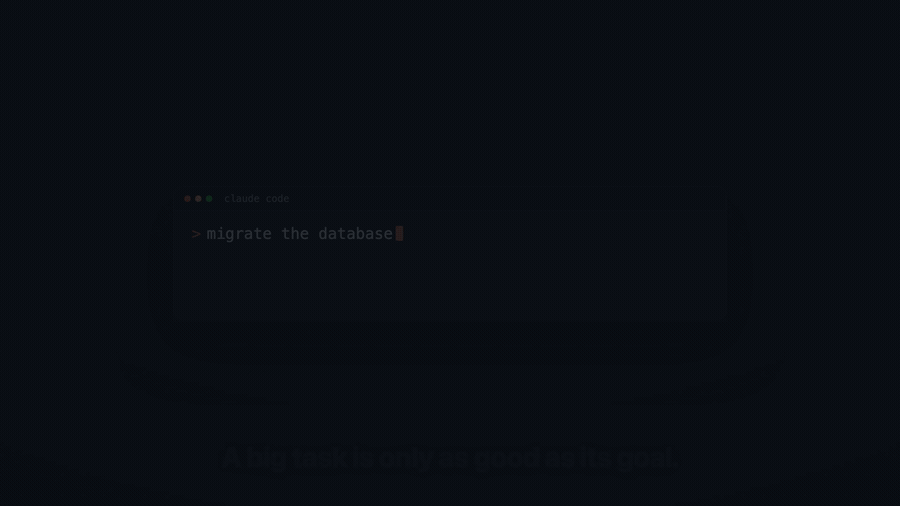

<p align="center">
  
</p>

<h1 align="center">goalify</h1>

<p align="center">
  <strong>goalify is a Claude Code skill that locks the few real decisions up front, wires the finish line to commands the run can check, and makes a fresh session verify every criterion before it calls a big task done.</strong>
</p>

<p align="center">
  <a href="LICENSE"></a>
  
  <a href="https://agentskills.io"></a>
  <a href="CONTRIBUTING.md"></a>
</p>

---

## Set the goal. Trust the run.

You scope a big task in chat: a refactor, a migration, a feature, an audit. Then you `/clear` for a clean session and the plan is gone. The run improvises, drifts on decisions you never made, and you can't tell whether it actually finished.

goalify closes that gap. It does the prep while it still has your context: it reads and researches the repo, then locks the few real decisions. Next it writes a `/goal` file with the finish line defined in commands the run can check. You `/clear` and run that file; a fresh full-context session executes the job and tests as it goes, stopping only when every criterion passes. On success, it cleans up after itself.

```text
> /goalify migrate our API from callbacks to async/await, keep tests green

  goalify researches the repo, locks the few real decisions, and writes the run file:
      ~/acme/.goal/callbacks-to-async.md

  then prints the two steps you run yourself, in a fresh session:
      /clear
      /goal ~/acme/.goal/callbacks-to-async.md
```

> [!IMPORTANT]
> goalify **prepares** the run; it doesn't run your task here. `/goalify` writes the file; the `/goal <path>` it prints is what you run next, in a fresh session, and that file deletes itself once the run succeeds. Your plan survives `/clear`.

<p align="center">
  
</p>

<p align="center"><sub><a href="assets/goalify-teaser.mp4">▶ 30-second teaser (MP4)</a> · set the goal, trust the run.</sub></p>

## Quick Start — plugin install (recommended)

goalify ships in the [**10x** marketplace](https://github.com/Aboudjem/10x):

```bash
claude plugin marketplace add Aboudjem/10x
claude plugin install goalify@10x
```

Restart Claude Code if it's already open, then run:

```text
/goalify migrate our API from callbacks to async/await, keep tests green
```

Or just say it:

```text
goalify this: <your task>
```

goalify writes a `/goal` file and prints two steps to run in a fresh session:

```text
/clear
/goal ~/your-repo/.goal/your-task.md
```

## Install (manual / skill-only)

```bash
git clone https://github.com/Aboudjem/goalify
mkdir -p ~/.claude/skills
cp -r goalify/skills/goalify ~/.claude/skills/goalify
```

This installs the `/goalify` skill, which authors the run file. You then `/clear` and run that file with Claude Code's built-in [`/goal <path>`](https://code.claude.com/docs/en/goal) command (Claude Code 2.1.139+). Restart Claude Code if it is already open so it loads the skill.

## Two ways to start

Run the command:

```text
/goalify <your task>
```

Or just say it, and the skill triggers on its own:

```text
goalify this: <your task>
```

Either way, goalify researches, locks the few real decisions in one quick batch (skipped if there are none), and prints your two steps: `/clear`, then `/goal <path>`.

## What you can trust

- **Sourced, then re-checked.** Every load-bearing fact in the file carries a source, and a separate agent re-derives the key claims.
- **Knows when it's done.** Success criteria are wired to real commands, so "finished" means the checks passed.
- **Tested.** Built test-first, with a recorded RED→GREEN baseline on Haiku, Sonnet, and Opus ([baseline](evals/RED-baseline.md)).
- **Safe by design.** Read-mostly prep, no remote fetch-and-execute, and a self-destruct that fires only on full success ([security](SECURITY.md)).

## What goalify writes

A `/goal` file ([see a real one](examples/sample-goal-file.md)) holds:

- a declarative spec: the end state and how it's verified, instead of a brittle step list;
- verified context with absolute paths, so the fresh session is never lost;
- machine-checkable success criteria tied to real commands;
- parallel fan-out for independent work, a progress checklist, and a gated self-destruct that deletes the file only on full success (and keeps it to resume otherwise).

## FAQ

**Does it run my task?** No. It writes the `/goal` file; you run it after `/clear`, in a fresh session. That separation is the point.

**Why a file instead of a prompt?** A chat plan dies at `/clear`. A file persists, carries absolute paths and cited research, and the run re-reads it every loop.

<details>
<summary>More questions</summary>

**What if the run can't finish?** The self-destruct is gated. If any criterion is unmet, the file stays in place so you can resume from it.

**Does it work outside Claude Code?** It's a spec-correct [Agent Skill](https://agentskills.io), so it should be portable to agents that support the [Agent Skills standard](https://code.visualstudio.com/docs/copilot/customization/agent-skills). The `/clear` and `/goal` hand-off is specific to Claude Code; adapt those two commands elsewhere.

**When should I not use it?** A one-line fix (just ask Claude), or open-ended exploration with no end state. goalify will decline rather than write a vague file.

**Is there a plugin?** Yes — goalify ships as a Claude Code plugin in the [**10x** marketplace](https://github.com/Aboudjem/10x) (`claude plugin install goalify@10x`), and the skill still works standalone (copy it into `~/.claude/skills/`). (Someone opened a Claude Code issue asking [how to carry a plan across `/clear`](https://github.com/anthropics/claude-code/issues/32916); it was closed as not planned, so goalify is one answer.)
</details>

## How it works

<p align="center">
  
</p>

1. **Research & decide.** goalify inspects the repo and locks the few real decisions.
2. **Write the `/goal` file.** A self-contained, self-deleting run file at an absolute path.
3. **Run in a fresh session.** You `/clear`, then `/goal <path>`; it executes, verifies, and cleans up.

The skill itself lives in [`skills/goalify/SKILL.md`](skills/goalify/SKILL.md); the evals are in [`evals/`](evals); for a first run, see the [quickstart](docs/quickstart.md).

## Contributing & license

Issues and PRs are welcome, and goalify is built test-first ([contributing](CONTRIBUTING.md) · [code of conduct](CODE_OF_CONDUCT.md)). [MIT](LICENSE).

---

<sub>Built by <a href="https://github.com/Aboudjem">Adam Boudjemaa</a>. Verified against Claude Code and the Agent Skills spec, 2026. <a href="https://github.com/Aboudjem/goalify/issues">Spot a gap?</a></sub>
