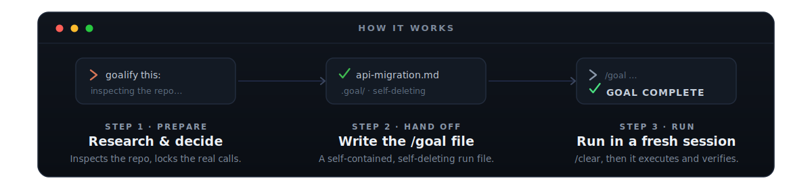

<p align="center">
  
</p>

<h1 align="center">goalify</h1>

<p align="center">
  <strong>goalify writes a single self-contained instruction file for a big task, so you can <code>/clear</code> your chat and let a fresh Claude Code session run the whole job on its own. When the job's done, the file deletes itself.</strong>
</p>

<p align="center">
  <a href="LICENSE"></a>
  
  <a href="https://agentskills.io"></a>
  <a href="CONTRIBUTING.md"></a>
</p>

---

## Sound familiar?

The plan died at the handoff. That's the gap goalify closes.

| The pain | What goalify does |
|---|---|
| You plan a big task in chat, then `/clear` for a clean session, and your whole plan is gone. | Writes the plan to **one file** that survives `/clear`. |
| The autonomous run drifts because Claude is guessing at decisions you never made. | Asks you those decisions **up front**, in one batch, and bakes the answers in. |
| Halfway through, the context window fills and the run starts forgetting why it's there. | The fresh session reads the file at **full context** and re-reads it every loop. |
| The run "finishes" but you can't tell if it actually worked. | Wires **machine-checkable success criteria** to real commands. |
| Stray scratch files pile up after the job. | A **gated self-destruct** cleans up, but only on full success. |

goalify does the thinking **now**, in your current session. It reads your repo, researches the task, asks the few decisions it genuinely can't infer, and writes **one** `/goal` file: a self-contained spec with cited context, absolute paths, and pass/fail success criteria wired to real commands. Then you `/clear` and run that file in a fresh session with a full context window, where the whole task runs end to end on its own. (You run `goalify` now to write the file; later, in the cleared session, you run the file itself with `/goal`.)

```text
you  ▸  goalify this: migrate our API from callbacks to async/await, keep tests green
       ┊ (goalify researches the repo, asks ~1 real question, writes the file)
goalify ▸  1.  /clear
           2.  /goal /Users/you/project/.goal/api-migration.md
```

> [!IMPORTANT]
> goalify **prepares** the run; it does not run your task. You run it in a fresh session, and the file deletes itself once the run succeeds.

## Install

It's a skill. No plugin, no marketplace. Drop it in:

```bash
git clone https://github.com/Aboudjem/goalify
mkdir -p ~/.claude/skills
cp -r goalify/skills/goalify ~/.claude/skills/goalify
```

That's it. No marketplace, no plugin, nothing fetched at runtime. If Claude Code is already open, restart it so it loads the skill, then say **`goalify this: <your task>`**.

## Two ways to use it

**Natural language.** Just say it; the skill triggers on its own:

```text
goalify this: <your task>
```

**Slash command.** The skill name is also a command:

```text
/goalify <your task>
```

Either way, goalify researches, asks you the few real decisions (one short batch of questions, skipped if there are none), and prints your `/clear` + `/goal <path>` steps. Copy the two steps and run them.

## What's in the file

Everything the fresh session needs, in one `/goal` file ([see a real one](examples/sample-goal-file.md)):

- **A declarative spec:** the end state and how it's checked, not a brittle step list.
- **Verified, cited context** with absolute paths, so the fresh session is never lost.
- **Machine-checkable success criteria** wired to real commands, so the run knows when it's done.
- **Max-effort directives** (it fans out parallel sub-agents for independent work), a progress checklist, and a **gated self-destruct** that deletes only on full success (and stays put to resume otherwise).

## goalify vs. winging it

| | goalify | A cold `/goal` from memory | Prompting by hand |
|---|:--:|:--:|:--:|
| Plan survives `/clear` | ✅ | ❌ | ❌ |
| Runs at full context | ✅ | ✅ | ❌ |
| Research done + cited first | ✅ | ❌ | rarely |
| Knows when it's done | ✅ | depends | depends |
| Cleans up after itself | ✅ | ❌ | — |

## Why you can trust it

- **Cited, not guessed:** every load-bearing fact in the file carries a source, and a separate agent re-derives the key claims.
- **Tested:** built test-first, RED→GREEN on Haiku, Sonnet, and Opus ([the baseline](evals/RED-baseline.md)).
- **Safe:** read-mostly preparation, no remote fetch-and-execute, and a gated self-destruct that fires only on full success ([SECURITY](SECURITY.md)).

## FAQ

**Does it run my task?** No. It writes the `/goal` file; you run it after `/clear`, in a fresh session. That separation is the whole point.

**Why a file instead of just prompting?** The plan has to survive `/clear`. A file persists, carries absolute paths and cited research, and the run re-reads it every loop. A chat plan can't.

<details>
<summary>More questions</summary>

**What if the run can't finish?** The self-destruct is gated: if any success criterion is unmet, the file stays so you can resume from it.

**Does it work outside Claude Code?** It's a spec-correct [Agent Skill](https://agentskills.io), portable to agents that support [the Agent Skills standard](https://code.visualstudio.com/docs/copilot/customization/agent-skills). The `/clear` + `/goal` handoff is Claude-Code-specific; adapt those two commands on another agent.

**When should I *not* use it?** A one-line fix (just ask Claude), or open-ended exploration with no definable end state. goalify will decline rather than write a vague file.

**Is there a plugin?** No, it's skill-only; the install above is all there is. (Someone even opened a Claude Code issue asking [how to carry a plan across `/clear`](https://github.com/anthropics/claude-code/issues/32916); it was closed as not planned, so goalify is one answer.)
</details>

## How it works

<p align="center">
  
</p>

1. **Prepare.** Research the task and lock the few real decisions.
2. **Hand off.** Author one self-contained, self-deleting `/goal` file.
3. **Run autonomously.** `/clear`, then `/goal <path>` in a fresh, full-context session.

The skill lives in [`skills/goalify/SKILL.md`](skills/goalify/SKILL.md) (the two-phase PREPARE → EXECUTE model, the goal-file template, the hard rules). Evals are in [`evals/`](evals); first run, the [quickstart](docs/quickstart.md).

## Contributing & license

Issues and PRs welcome. goalify is built test-first ([CONTRIBUTING](CONTRIBUTING.md) · [Code of Conduct](CODE_OF_CONDUCT.md)). [MIT](LICENSE).

---

<sub>Built by <a href="https://github.com/Aboudjem">Adam Boudjemaa</a>. Verified against Claude Code and the Agent Skills spec, 2026. <a href="https://github.com/Aboudjem/goalify/issues">Spot a gap?</a></sub>
