<p align="center">
  <picture>
    <source media="(prefers-color-scheme: dark)" srcset="../assets/hero-dark.svg">
    <source media="(prefers-color-scheme: light)" srcset="../assets/hero-light.svg">
    
  </picture>
</p>

<p align="center">
  <a href="https://github.com/Aboudjem/goalify/actions/workflows/validate.yml"></a>
  <a href="../LICENSE"></a>
  <a href="https://github.com/Aboudjem/goalify/stargazers"></a>
</p>

<p align="center">
  <a href="../README.md">English</a> · <a href="zh-CN.md">简体中文</a> · <a href="ja.md">日本語</a> · <b>Español</b> · <a href="fr.md">Français</a>
</p>

<p align="center">
  <strong>Dale a Claude una tarea enorme. Vuelve y encuentra la prueba de que está hecha, no la promesa de que lo está.</strong>
</p>

<p align="center">
  <a href="#qué-hace">Qué hace</a> · <a href="#instalación">Instalación</a> · <a href="#cómo-usarlo">Cómo usarlo</a> · <a href="#qué-obtienes">Qué obtienes</a> · <a href="#funciona-en-tu-editor">Funciona en tu editor</a> · <a href="#conviene-saber">Conviene saber</a>
</p>

```bash
claude plugin marketplace add Aboudjem/10x
claude plugin install goalify@10x
```

## Qué hace

Hay trabajos demasiado grandes para quedarse mirando. Renombrar una cosa en cientos de archivos.
Llevar un proyecto viejo a una versión más nueva del código sobre el que está construido. Recorrer un
proyecto desordenado para limpiar un solo tipo de problema. Describes el trabajo mientras Claude
todavía tiene tu contexto, y goalify escribe qué tiene que hacer la ejecución y qué aspecto tiene
estar terminado. Después te entrega una línea para pegar.

- **El informe** es un archivo con todo lo que la ejecución necesita: tus decisiones, las rutas
  exactas, el orden del trabajo.
- **La condición** es la línea que pegas en `/goal`, la comprobación de parada que Claude Code trae
  de serie, que mantiene la sesión trabajando y juzga cada turno frente a esa línea.

Imagina una obra. El informe son los planos con los que trabaja quien construye. La condición es la
lista que firma quien inspecciona, y esa persona nunca lee los planos ni pisa la obra. Solo juzga las
pruebas que le enseñan.

## Instalación

```bash
claude plugin marketplace add Aboudjem/10x
claude plugin install goalify@10x
```

Cualquier otro agente, en una línea:

```bash
npx skills add Aboudjem/goalify
```

<details>
<summary>Copiarlo a mano</summary>

```bash
git clone https://github.com/Aboudjem/goalify
cp -R goalify/skills/goalify ~/.claude/skills/
```

En tiempo de ejecución no hace falta nada más del repositorio. Necesitas Claude Code 2.1.139 o
posterior, porque es la versión en la que llegó `/goal`. El resto está en la
[guía rápida](../docs/quickstart.md).
</details>

## Cómo usarlo

**1. Describe el trabajo.** Ejecuta `/goalify` y tu tarea en Claude Code. goalify lee tu proyecto,
pregunta por las pocas decisiones reales, escribe el informe e imprime la condición.

```text
/goalify migrate our API to async/await
    Brief:     ~/acme/.goal/api-migration.md
    Condition: 149 chars, under the 4,000 limit
```

**2. Vacía el chat.** `/clear` borra la conversación, así la ejecución empieza de cero y con toda la
atención.

**3. Pega la condición.** La línea entera. En pantalla se parte en varias, así que cógela toda.

```text
/goal Do everything in ~/acme/.goal/api-migration.md and prove it - done when the last turn quotes npm test passing and says ASYNC-OK. Stop after 40 turns.
```

La ruta del informe viaja dentro de esa línea, porque el evaluador que hay detrás de `/goal` no tiene
herramientas y no puede abrir archivos. Lee la línea que pegas y una transcripción recortada de la ejecución, nunca el informe en sí. Darle la ruta a secas
no falla en nada y no prueba nada, y por eso es el error más fácil de cometer:

```text v1-antipattern
/goal ~/acme/.goal/api-migration.md
```

¿Dudas de una línea antes de pegarla?
`python3 skills/goalify/scripts/condition_lint.py "<your condition>"` la comprueba contra seis
reglas mecánicas y nombra las que falla. Los juicios siguen siendo tuyos.

<p align="center">
  
</p>

## Qué obtienes

- **Una sola línea que entregar.** Vacía el chat, pega una línea y márchate.
- **Tu contexto sobrevive al reinicio.** El informe lleva tus decisiones a la sesión nueva.
- **Progreso que se ve de un vistazo.** La ejecución va marcando una lista dentro del informe.
- **Pruebas, no promesas.** El último turno tiene que citar las comprobaciones pasando e imprimir una
  palabra inventada, `ASYNC-OK` arriba, así que una ejecución que se saltase el trabajo tendría que
  mentir sin disimulo.
- **Un final ordenado al llegar al tope.** Cerca del límite de turnos, la ejecución deja de empezar
  cosas nuevas, termina o revierte lo que está a medias y dice en su respuesta de cierre que paró
  antes.
- **Parar conserva tu progreso.** El informe se queda donde está con su lista intacta. Retomas pegando
  la misma línea, no empiezas de nuevo.
- **Archivado solo si sale bien.** El turno de cierre repite todas las comprobaciones, cita la salida
  y mueve el informe a `.goal/done/`, un movimiento de archivo que ves en cualquier explorador.

## Funciona en tu editor

Funciona en Claude Code, Cursor, Codex, Copilot, Gemini CLI y más de 70 agentes a través de
`npx skills add`. La habilidad es Markdown puro, así que nada en ella está atado a un modelo.

| Agente | Instalación en una línea |
|:--|:--|
| Claude Code | `claude plugin install goalify@10x` |
| Cualquiera de los más de 70 agentes | `npx skills add Aboudjem/goalify` |
| Cursor, Codex, Copilot, Gemini CLI, OpenCode | `npx skills add Aboudjem/goalify -a <agent>` |
| Todo lo demás | los códigos de agente y las rutas en [docs/editors.md](../docs/editors.md) |

`/clear` y `/goal` son comandos de Claude Code. En otros sitios, abre una sesión nueva en lugar de
`/clear` y dale la condición como objetivo permanente. Codex tiene su propio `/goal`, y
[usarlo en Codex](../docs/codex.md) explica qué se traslada y qué no.

## Conviene saber

> [!IMPORTANT]
> Que una ejecución pare no prueba que haya terminado. El evaluador juzga por su cuenta y puede
> cerrar una ejecución al decidir que la meta es inalcanzable. Antes de fiarte de un resultado en
> verde, relee las pruebas del cierre, las comprobaciones citadas en la última respuesta y el informe
> movido a `.goal/done/`, o repite tú mismo las comprobaciones.

- **goalify escribe, nunca ejecuta.** Escribe los dos artefactos en esta sesión y para. La ejecución
  la arrancas tú.
- **Nada corre de fondo.** Una habilidad en Markdown, sin servidor, sin dependencias que instalar y
  sin llamadas de red propias.
- **Todo lo que no promete** está escrito en [límites honestos](../docs/limits.md).

## Más información

- [Guía rápida](../docs/quickstart.md), una primera ejecución de principio a fin y las otras formas
  de instalar.
- [Condiciones trabajadas](../examples/conditions.md), ocho que merecen enviarse y ocho que evitar,
  cada una con una línea que dice qué pierde la mala.
- [Un ejemplo trabajado](../examples/sample-brief.md), un informe real y la condición derivada de él.
- [Instalar en tu editor](../docs/editors.md) · [Preguntas frecuentes](../docs/faq.md) · [Usarlo en Codex](../docs/codex.md)
- [Límites honestos](../docs/limits.md) · [Registro de cambios](../CHANGELOG.md) · [La habilidad en sí](../skills/goalify/SKILL.md) · [Licencia](../LICENSE)

<p align="center"><sub><a href="../assets/goalify-teaser.mp4">Ver el avance de 28 segundos</a> · <a href="../assets/goalify-teaser.gif">GIF</a></sub></p>

---

<sub>Hecho por <a href="https://github.com/Aboudjem">Adam Boudjemaa</a>. Licencia MIT. El
comportamiento de `/goal` se volvió a derivar del binario distribuido de Claude Code 2.1.223, 2026.
<a href="https://github.com/Aboudjem/goalify/issues">¿Ves algo que falta?</a></sub>

<sub>Traducción asistida por máquina. La versión de referencia es el <a href="../README.md">README.md</a> en inglés.</sub>
