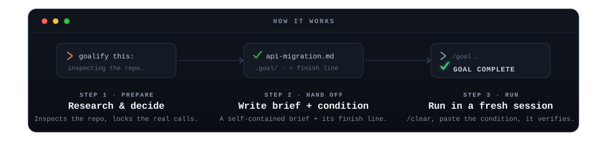
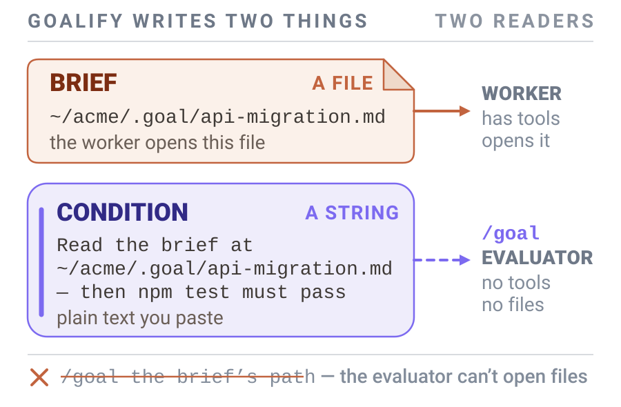

# Quickstart

Hand Claude a huge task. Come back to proof it's done — not a promise that it is. You do the prep
**before** you `/clear`, then start the run in a fresh session that has its whole attention on the job.

goalify only **writes** the run. It does not do your task, and you are the one who starts it. It
writes two things: a **brief**, the Markdown file the run works from, and a **condition**, the plain
line the run has to prove it satisfied.

---

## 0. Prerequisites

- **Claude Code**, installed and working. goalify is a Claude Code skill (an Agent Skill).
- **A big job you can describe clearly.** Moving a project onto a library it has outgrown, renaming
  one thing across hundreds of files, adding the same missing check everywhere, reading through a
  whole codebase for one kind of bug — something worth a session of its own. For a one-line fix, just
  ask Claude to do it; you do not need an autonomous run for that. The rest of the skip list is in
  [when NOT to use it](#when-not-to-use-it).

---

## 1. Install

**The plugin is the shortest route:**

```shell
claude plugin marketplace add Aboudjem/10x
claude plugin install goalify@10x
```

**Or copy the skill in by hand:**

```shell
git clone https://github.com/Aboudjem/goalify.git
mkdir -p ~/.claude/skills
cp -r goalify/skills/goalify ~/.claude/skills/goalify
```

Either way you get `/goalify`, which writes the run. You start the run yourself with Claude Code's
built-in `/goal <condition>` command, which needs
[Claude Code 2.1.139+](https://code.claude.com/docs/en/goal).

**Claude Code finds the skill on its own.** Restart it if it was already open — and a brand-new
top-level skills folder may need that one restart before Claude Code watches it. To update later,
pull again and re-copy. To remove it, delete `~/.claude/skills/goalify`.

---

<p align="center">
  
</p>

goalify reads the repo and settles the few real decisions, then writes the brief and derives the
condition from it. You `/clear` and paste the condition into `/goal`. The run proves every criterion
in one closing turn before the brief is filed away.

## 2. Use it

1. **Ask in plain language.** Type `goalify this: <your big task>` — for example,
   *"goalify this: migrate our Express API from callbacks to async/await and keep the tests green."*

2. **Answer the short batch of questions.** You only get one if goalify finds a real fork in scope,
   structure or risk. Then it writes the brief to an absolute path, derives the completion condition
   from it, and prints the two commands you run yourself.

3. **Run those two commands.** `/clear` first, then the `/goal` line goalify printed. That line is
   long because it *is* the condition text, and the brief's absolute path rides along inside it so
   the fresh session knows where to start reading. Paste the whole thing.

   **What `/goal` receives is text, not a file.** The evaluator behind `/goal` — the judge that
   decides each turn whether you are done — has no tools and cannot open anything. Hand it the
   brief's path and that path simply becomes the condition, so every turn the evaluator is asked
   whether the string `~/acme/.goal/api-migration.md` is satisfied. The transcript can never answer
   that question.

   **Nothing errors when that happens,** which is what makes it worth knowing. The main agent has
   full tools, so it reads the path and starts working, and the run looks healthy. What breaks is the
   stopping check: the loop's exit test is now a string the evaluator cannot interpret, so the run
   keeps going past real completion. You can still spot it — `/goal` with no argument shows the
   evaluator's most recent reason, which here reads something like "insufficient evidence in
   transcript".

   ```text v1-antipattern
   # what you paste — the condition text itself (ONE line of 149 characters; wrapped here to fit)
   /goal Do everything in ~/acme/.goal/api-migration.md and prove it — done when the last turn
   quotes npm test passing and says ASYNC-OK. Stop after 40 turns.

   # not the brief's path on its own
   /goal ~/acme/.goal/api-migration.md
   ```

   **`/goal` does not change your permission mode.** Auto mode is the default in current Claude Code,
   so an unattended run usually needs nothing extra. If you have changed it, turn auto mode back on
   (Shift+Tab, `--permission-mode auto`, or `/permissions`).

   A fresh session then reads the brief with its full attention, fans out its own agents, verifies,
   tests, and **proves every criterion in one closing turn** before it stops.

If the condition is long and you would rather not scroll back for it, goalify also saved it to
`.goal/CONDITION-<slug>.txt`, so `pbcopy < .goal/CONDITION-<slug>.txt` gets you the same text. That
is a convenience, not the step.

**Running it with no terminal window at all:** the headless form is
`claude -p "/goal <condition>" --permission-mode auto`. Same condition string, typed on the command
line instead of pasted.

That is it. **Step 1 touches nothing in your repo except `.goal/`** — goalify researches, then writes
the two artifacts there, and changes no code. The work happens in the fresh `/goal` session, under
the hard rules baked into the brief: nothing invented, verification by a separate agent, tests, and a
pause before anything destructive.

---

<p align="center">
  
</p>

## What you get

- **One self-contained brief** — a plain statement of what done means, context checked against the
  real files with absolute paths, your locked decisions, phases in the order they depend on each
  other, rules for what may run in parallel and what must run one at a time, a definition of done
  wired to real commands, a progress checklist, and a gated archive step.
- **A checked condition string** — under 4,000 characters, carrying a made-up word the run has to
  say, the exact commands whose output must be quoted, a closing-turn requirement, and a hard limit
  on how many turns the run gets.
- **A run that starts fresh** — the execute session begins at full context, not on the dregs of a
  long chat.
- **A paper trail, not clutter** — on success the brief moves to `.goal/done/` with a completion
  stamp; if the run did not finish, it stays put so you can resume. Either way you can hold what was
  promised next to what happened. The condition file stays in `.goal/` too, and you can delete both
  whenever you like.

One caveat worth knowing up front: **a `/goal` run that stops is not proof the work is done.** The
evaluator can end a run by judging the condition unachievable. Read the closing evidence packet, or
re-run the brief's definition-of-done commands yourself, before you believe a green result. More in
[honest limits](limits.md).

See a real example: [`examples/sample-brief.md`](../examples/sample-brief.md).

---

## When NOT to use it

- **A trivial change** — just ask Claude to do it.
- **Open-ended exploration with no end state you can name** — goalify declines rather than write a
  vague brief, so explore interactively instead.
- **Work you want done right now, in this session** — use `autopilot`, `ultrawork` or `ralph`.
