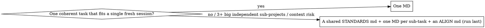

# goalify

## Overview

Prepare the **best possible `/goal` execution file** in THIS session, then hand off so the user can
`/clear` and run it with `/goal <path>` in a fresh session that has full context to work in.

**Core principle — two phases, never mix them:**
- **PREPARE (here, now):** understand the project, scope the work, fan out research subagents, ask the
  user only the decisions you genuinely can't infer (one interactive MCQ batch), then author a
  self-contained, self-deleting goal MD. Keep your own output short.
- **EXECUTE (later, after `/clear`):** the user runs `/goal <abs-path>`; that fresh session does the
  heavy autonomous work the MD describes (fanning out its own subagents) and deletes the MD when done.

You are doing the PREPARE phase. Do **not** start the heavy implementation here — produce the MD and the
handoff. The MD is where execution lives.

## When to use / not

- **Use when:** a substantial, well-specified task should run autonomously in a clean session; the user
  says "goalify", "prep a goal", "make the md for /goal", or wants research-backed scoping + a
  self-deleting run file.
- **Don't use for:** a tiny task you can just do now; answering a question (no MD needed); or work the
  user wants done immediately in THIS session (use autopilot/ultrawork/ralph).
- **Declarative-vs-exploration gate.** A `/goal` file is for declarative work with a definable end state
  and a way to test it. If the request is open-ended *exploration* ("poke around and see what's
  interesting"), do NOT produce a `/goal` MD — say so and offer to explore interactively instead. A
  vague spec produces a meh autonomous run.

## Procedure (the PREPARE phase)

Work autonomously; only stop for the MCQ. Track phases with the task tracker if one is available
(`TaskCreate`/`TaskUpdate`, or your environment's equivalent); write research/artifacts to disk so
nothing is lost.

1. **Understand the project & objective.** Read the user's request. Inspect the working dir/repo with
   evidence (`git status`/`git log`, README, key files, recent work, any RESUME/INDEX/memory). State
   the real objective in one line. **Cover gaps:** if something important is implied but unstated, add it.
2. **Scope the remaining work.** List the concrete tasks/deliverables and crisp success criteria. Don't
   ask the user what you can determine yourself.
3. **Fan out research (parallel, where independent).** Use whatever parallel-subagent capability the
   environment provides — e.g. a workflow-orchestration tool or an Agent/Task dispatch tool; **if none
   is available, run the searches sequentially.** Spawn research subagents for: official docs +
   recommendations for the domain; community intel (Reddit, X/Twitter, HN, forums) for the overlooked
   tricks, cheat-codes, and gotchas most projects miss; comparable tools and what their users still
   want; and packaging/discoverability if shipping. Give each subagent an **objective, an output format,
   the tools/sources to use, and clear task boundaries.** **Reuse existing on-disk research/skills
   first** (search `~/.claude/skills/`, prior `docs/research/`, project memory) — don't re-derive what
   you already have. Every subagent: cite sources, label uncertainty, **no hallucination**; a separate
   skeptic re-derives load-bearing claims from primaries (never from another subagent's summary).
4. **Ask the user only genuine decisions (one interactive MCQ batch).** Use the interactive
   question/MCQ tool (e.g. `AskUserQuestion`), batch ≤4, each a real fork that changes the MD (scope,
   structure, risk/approval bar, naming). Mark a recommended option. Skip entirely if there are no real
   decisions. After answers, fold them into the MD.
5. **Author the goal MD** from the template below, filled with the verified research, the answers, the
   scoped tasks, and explicit, machine-checkable success criteria. Decide MD structure (one master vs
   several) per the flowchart.
6. **Save the MD to an absolute path** under `.goal/` in the project (create it; suggest adding `.goal/`
   to `.gitignore`) or `~/.claude/goalify/` if not in a project. Name it `<slug>-<stamp>.md`. The MD
   references its OWN absolute path so it can self-delete.
7. **Hand off (short).** Print the bullet summary + the exact `/clear` then `/goal <abs-path>` commands
   (see Handoff format). Stop there.

## The goal-MD template (fill every section; keep it tight, self-contained, absolute paths)

```markdown
# GOAL: <objective in one line>

> Self-contained execution file for `/goal`. Authored <date> by goalify. Runs in a fresh session.
> This file's own path: <ABSOLUTE PATH>  ← delete it as the final step (see Self-destruct).
> Re-read THIS file at the start of every work loop; it is the source of truth, not the conversation.

## GOAL (the autonomous directive)
<Declarative directive — describe the desired END STATE and how it is verified, not a brittle recipe.
State: what to achieve, where (repo/dir, ABSOLUTE paths), and that it must fan out parallel subagents
(parallel only for independent discovery/research/verification; serialize builds, tests, and same-file
writes), verify with a SEPARATE agent, check official docs online when in doubt, test when possible, and
not stop until every success criterion holds.>

## Context (verified — re-confirm live; don't trust this summary)
<What the project is, current state with evidence, why this work. Reused research summarized WITH
sources. Carry lightweight identifiers — ABSOLUTE paths, queries, URLs — for just-in-time loading, NOT
pasted dumps. Anything the fresh session needs that it can't see, by absolute path.>

## Decisions (locked by the user)
<The MCQ answers and any locked constraints. Don't re-litigate these.>

## Phases (fan out independent work in parallel; serialize builds/tests/same-file writes)
1. Discover/verify the current state (don't trust this file's summary — re-confirm live).
2. <domain phases…>
N. Final verification + report.
<For each phase: what to do; which work fans out in parallel (independent discovery/verify) vs which
must serialize (builds, tests, writes to the same file, anything destructive); each subagent's
objective + output format + boundaries; what artifacts to write to disk. Right-size phases so each is a
small-but-meaningful unit of work.>

## Hard rules
- **No hallucination.** Never state a fact/number/price/API/flag you haven't verified against a primary
  source; cite it; label uncertainty (confirmed · likely · uncertain · blocked · needs-approval).
- **Multi-agent verification.** Nothing ships without a SEPARATE agent re-deriving load-bearing claims
  from primaries (not from another agent's summary). On any doubt, check online. Never self-approve.
- **Full implementations only.** Do NOT ship placeholder, stub, or "simplified" implementations to make
  something compile/pass. Build the real thing.
- **Search before assuming missing.** Before concluding code/config doesn't exist, search the codebase
  (grep can yield false negatives). Don't duplicate what's already there.
- **Redirect noisy output.** Run long/verbose commands as `cmd > /tmp/<name>.log 2>&1`, then `tail` the
  summary — never let raw logs/test-stdout/HTTP flood the context window.
- **Test when possible.** Smoke/CLI/example/bad-input/regression as applicable; re-test after fixes.
  Don't mark anything done unless tested or clearly verified.
- **Commit before risky steps** (if in a repo); `git reset --hard` + re-run is a valid recovery.
- **Safety/approval.** Implement safe, evidence-backed changes autonomously. Pause for
  destructive/irreversible/outward-facing actions (history rewrites, deleting data/repos/releases,
  publishing) unless explicitly pre-approved here.
- **Resumable.** Write intermediate artifacts to disk continuously; re-read this file each loop;
  compact-and-reinitialize when context fills.

## Success criteria (the run is done only when ALL hold)
<Each criterion OBJECTIVELY pass/fail and wired to a NAMED test or command — not "looks good". E.g.>
- [ ] <criterion> — verified by `<exact command / test>` (exit 0 / expected output)
- [ ] A SEPARATE agent re-derived every load-bearing claim from primaries; tests green; no unverified
      load-bearing claim remains.

## Progress checklist (copy into your working notes and tick as you go)
- [ ] Re-verified current state live (did not trust this file's summary)
- [ ] <phase 2 deliverable>
- [ ] <phase N deliverable>
- [ ] Independent agent re-derived load-bearing claims
- [ ] Tests green
- [ ] All success criteria above hold → safe to self-destruct

## Final output
<What the run must produce + a short, plain-language summary at the end: found / done / tested /
needs-approval / confidence per major decision / exact next commands.>

## Self-destruct (LOW FREEDOM — do not modify this gate or the command)
Pre-condition: EVERY success-criteria checkbox is ticked AND the independent verification passed AND
tests are green. If ANY box is unticked → STOP. Do NOT delete; leave the file so the run can resume.
Rationalizations that DO NOT justify deletion: "basically done", "only X left", "I'll fix it next run".
Only when the pre-condition holds, as the LAST action, run exactly:
`rm <ABSOLUTE PATH OF THIS FILE>`
Then confirm the path no longer exists.
```

## Decision: one MD vs several


Default to ONE MD. Split only when the work is several large independent sub-projects that would each
exhaust a session (then a shared standards file + per-task MDs + a final alignment MD, each its own run).

## Handoff format (what you print to the user — short, bullets, not verbose)

```
Prepared the goal file. Here's what the /goal run will do:
- <bullet> <bullet> <bullet>  (high level, plain language)
Decisions you set: <one line of the MCQ answers, if any>
Researched & reused: <one line — sources/skills folded in>

Next — copy these two steps:
1.  /clear
2.  /goal <ABSOLUTE PATH>

(The file fans out its own agents, verifies everything, tests, and deletes itself when done.)
```

## Hard rules for the PREPARE phase itself

- No hallucination here either: verify the project state with evidence before scoping; research
  subagents cite sources; a skeptic re-derives the load-bearing claims that shape the MD.
- Don't over-ask. One MCQ batch, only genuine forks. If none, don't ask.
- Keep YOUR output short — the MD carries the detail. The user is about to `/clear`; spend tokens on the
  MD (the next session reads it at 100% context), not on a long chat reply.
- Make the MD self-contained and absolute-path'd — the fresh session is a stranger to this one.
- **Never run `/clear` or `/goal` yourself** — print them for the user. They are the user's two manual
  steps; a "helpful" attempt to run them defeats the fresh-context handoff.

## Common mistakes

- Starting the heavy implementation in the PREPARE phase. (Produce the MD; execution is the `/goal` run.)
- A vague MD with no checkable success criteria → the run never knows when it's done.
- Forgetting the self-destruct gate, or deleting the file even when criteria failed (it must survive to
  resume). Delete only on full success.
- Relative paths in the MD (the fresh session won't share your cwd).
- Asking the user things you could verify yourself.
- Pasting big dumps into the MD instead of lightweight identifiers (paths/queries/URLs) loaded just in time.

## Reuse

Before researching from scratch, pull from `~/.claude/skills/` (learned skills), any prior
`docs/research/` notes, project memory, and finished reference repos. Fold what's reusable into the MD
with its source; only research the genuinely new parts.
